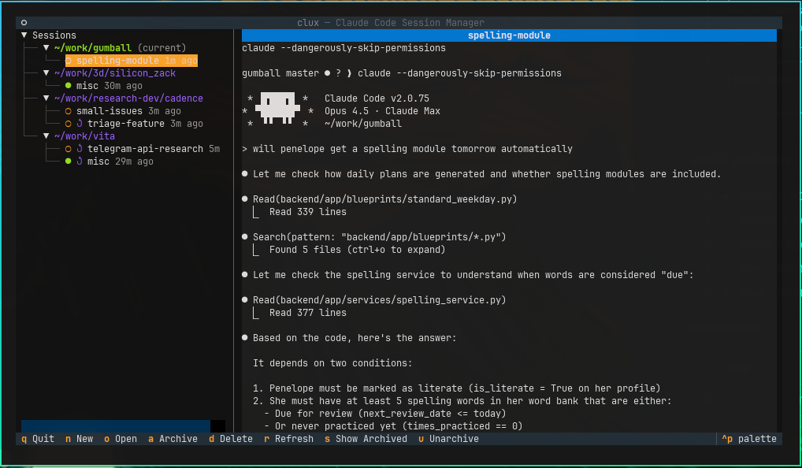

# clux

tmux-native session management for Claude Code.



sessions grouped by project directory. live preview of the selected session. keyboard-driven: `n` to create, `enter` to attach, `a` to archive, `d` to delete.

## the problem

Claude Code sessions are ephemeral by default. you interact, close the terminal, context is gone. Claude has `--resume` to bring sessions back, but you need the session ID, and you need to track which session belongs to which project. this gets tedious.

clux treats Claude sessions as first-class persistent entities - like tmux treats terminal sessions. create a session, work on it, detach, come back later. the session survives terminal death because clux captures the Claude session ID and stores it.

## install

```bash
git clone https://github.com/zackham/clux.git
cd clux
uv sync
ln -sf $(pwd)/.venv/bin/clux ~/.local/bin/clux
```

requires: python 3.12+, tmux, claude cli

## usage

```bash
clux                      # open TUI (default)
clux new api              # create session, launch claude, attach
clux attach api           # resume session (handles tmux death gracefully)
clux list                 # show sessions
clux archive api          # hide without deleting
clux delete api           # permanent removal
```

single-letter aliases: `clux n`, `clux a`, `clux l`, `clux d`, `clux s`

### non-interactive

```bash
clux prompt api "analyze the error in src/main.rs"
clux p api "what files did you modify?" --json
```

useful for automation, piping output, or integration with other tools.

## how it works

```
clux new api
  ↓
  tmux session created (clux-api)
  ↓
  claude launched inside
  ↓
  you work, then detach (ctrl-b d)
  ↓
  clux captures claude session ID → stored in db
  ↓
later:
  clux attach api
  ↓
  if tmux still alive → attach directly
  if tmux dead but ID exists → spawn new tmux + claude --resume <id>
  if neither → fresh claude session
```

sessions are scoped to directories. you can have "api" in both `~/work/vita` and `~/work/rwgps` without collision.

## TUI keybindings

| key | action |
|-----|--------|
| `n` | new session |
| `enter` / `o` | attach to selected |
| `a` | archive |
| `u` | unarchive |
| `d` | delete (with confirmation) |
| `r` | refresh |
| `s` | toggle show archived |
| `tab` | navigate between directories |
| `q` | quit |

status indicators in the sidebar:
- `●` green = active (tmux attached)
- `○` yellow = detached (tmux alive, not attached)
- `○` white = idle (tmux dead, but claude session ID preserved for resumption)
- `◌` dim = archived

## config

`~/.config/clux/config.toml`:

```toml
yolo_mode = true          # adds --dangerously-skip-permissions to claude
claude_command = "claude" # custom claude binary path
```

yolo mode is on by default. pass `--safe` to any command to disable for that invocation.

## data

- **registry:** `~/.local/share/clux/sessions.db` (SQLite with WAL mode)
- **claude sessions:** `~/.claude/projects/` (Claude's native storage)

clux doesn't store conversation content - it just tracks the mapping between your named sessions and Claude's internal session IDs.

## session lifecycle

| status | meaning | what attach does |
|--------|---------|------------------|
| active | tmux alive, attached | switch to it |
| detached | tmux alive, not attached | attach to tmux |
| idle | tmux dead, claude ID exists | spawn tmux + `claude --resume` |
| archived | hidden from default views | restore first, then attach |

## integration

`clux list --json` outputs session data for external tools:

```json
[
  {
    "name": "api",
    "directory": "/home/user/work/myproject",
    "status": "idle",
    "claude_session_id": "a1b2c3d4-...",
    "last_activity": "2026-02-01T14:30:00"
  }
]
```

## limitations

- one session per (name, directory) pair
- session ID capture depends on Claude's file structure
- non-interactive prompt kills any existing tmux process in the session (by design)
- Linux/macOS only (tmux dependency)

## license

MIT
