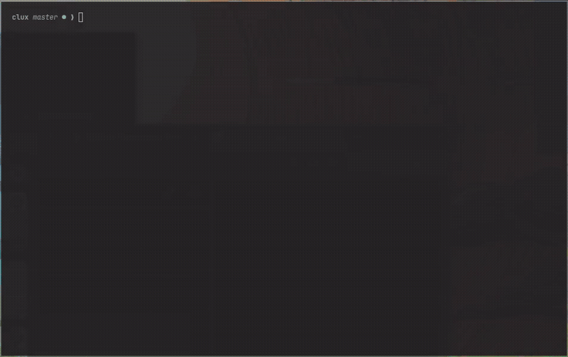

# clux

Claude Code session manager. fast switching between projects, with full context restored.



## install

```bash
curl -fsSL https://raw.githubusercontent.com/zackham/clux/master/install.sh | bash
```

or directly: `uv tool install git+https://github.com/zackham/clux.git`

requires: python 3.12+, tmux, [claude cli](https://docs.anthropic.com/en/docs/claude-code)

## usage

```bash
clux                      # open TUI
clux new api              # create session in current directory
clux attach api           # resume (survives terminal death)
clux close api            # archive + kill in one step
```

sessions are scoped to directories — "api" in `~/work/foo` and "api" in `~/work/bar` are separate. context is preserved across detach, terminal close, and reboot via `claude --resume`.

### tmux menu (`ctrl-b j`)

from inside any clux session:

- **Archive & Close** — archive the session and kill tmux
- **Next Session** — switch to the next session in the same project
- **Open clux** — open the TUI as a popup overlay

injected automatically. no tmux config needed. `j` is unbound in default tmux.

### TUI keybindings

`n` new · `enter`/`o` open · `a` archive · `d` delete · `k` kill · `s` show archived · `q` quit

## API

```bash
clux list --json                          # all sessions as JSON
clux prompt api "run the tests"           # send prompt, stream response
clux prompt api "deploy" --dir ~/work/api # target a specific directory
clux prompt api "status" --json           # raw NDJSON (cost, tool use, session ID)
```

`clux prompt` returns exit code 0 on success and streams to stdout — built for scripting, bots, and CI.

## config

`~/.config/clux/config.toml`:

```toml
yolo_mode = true          # --dangerously-skip-permissions by default
claude_command = "claude" # custom binary path
```

## license

MIT
